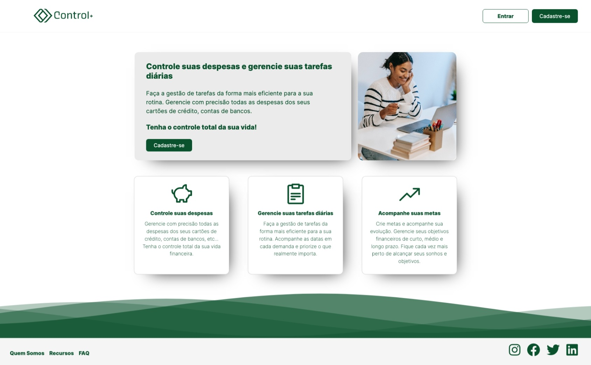
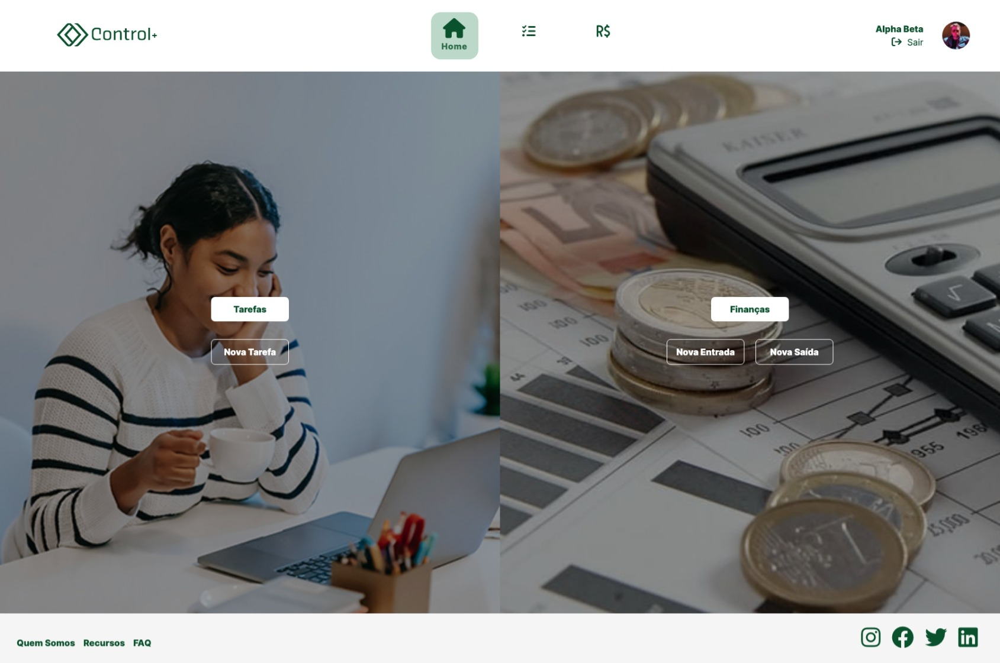

# Control+

[Control+](https://controlplus.pro) is a personal financial management tool in Portuguese. It provides users with a straightforward and responsive platform to manage their tasks and finances.

## Features

- Task management:
  - Create, edit, and delete tasks.
  - Mark tasks as done or unmark them.
  - Rearrange tasks using a mouse or fingers on the task list page.
  - Search for specific tasks with the search bar.
  - Task entries contain a description, date, and time.

- Financial management:
  - Manage receivables (entradas) and payables (saídas).
  - Search for finance entries with a search bar.
  - Create, edit, and delete financial entries.
  - Separate pages for receivables and payables, each with its own entries.
  - Displays for the total of receivables or payables and the overall total (receivables - payables).
  - Visual cues for the user's financial status (black for positive balance, blinking red for negative balance).

- Fully responsive design for tablets and mobile devices.

This was the capstone project during Le Wagon São Paulo's bootcamp, between July and September 2022. The authors' info can be found below.

## A Quick Look

<br>
<div style="display:flex">
  <div style="flex:1;padding-right:10px;">
    
    <p style="text-align:center;">What users see when not logged in</p>
  </div>
  <div style="flex:1;padding-left:10px;">
    
    <p style="text-align:center;">What users see when logged in</p>
  </div>
</div>
<br>

## Table of Contents

- [Installation and Setup](#installation-and-setup)
  - [Prerequisites](#prerequisites)
  - [Dependencies](#dependencies)
  - [Configuration](#configuration)
  - [Running the project locally](#running-the-project-locally)
  - [Deployment](#deployment)
- [Usage](#usage)
- [Contributing](#contributing)
- [Credits](#credits)
- [License](#license)

## Installation and Setup

This web application can be accessed directly at [https://controlplus.pro](https://controlplus.pro). If you want to set up the project locally or contribute to its development, follow these steps:

### Prerequisites

1. [Ruby](https://www.ruby-lang.org/en/) 3.1.2
2. [Rails](https://rubyonrails.org/) 7.0.3.1
3. [Node.js](https://nodejs.org/en/) 16.x.x
4. [Yarn](https://yarnpkg.com/) 1.22.19
5. [PostgreSQL](https://www.postgresql.org/)
6. [Cloudinary](https://cloudinary.com/) account and credentials for image hosting

### Dependencies

In addition to the prerequisites, you'll need to install the following external libraries or packages:

- [Devise](https://github.com/heartcombo/devise)
- [Simple Form](https://github.com/heartcombo/simple_form)
- [Stimulus](https://stimulus.hotwire.dev/) version 3.1.0
- [@hotwired/turbo-rails](https://turbo.hotwire.dev/) version 7.1.3
- [Bootstrap](https://getbootstrap.com/) version 5.2.0
- [Popper.js](https://popper.js.org/) version 2.11.6
- [Sortable.js](https://github.com/SortableJS/Sortable) version 1.15.0
- [Sweetalert](https://sweetalert.js.org/) version 2.1.2
- [Sweetalert2](https://sweetalert2.github.io/) version 11.4.32
- [Typed.js](https://mattboldt.com/demos/typed-js/) version 2.0.12
- [Webpack](https://webpack.js.org/) version 5.74.0
- [Webpack-cli](https://webpack.js.org/api/cli/) version 4.10.0

### Configuration

No additional configuration is needed beyond the standard Rails configuration.

### Running the project locally

To run the project locally, follow these steps:

1. Clone the repository to your local machine: `git clone https://github.com/your_username/your_project.git`
2. Change into the project directory: `cd your_project`
3. Install the required Ruby gems: `bundle install`
4. Install the required JavaScript packages: `yarn install`
5. Set up the database: `rails db:create db:migrate db:seed`
6. Start the development server: `rails s`

Now you can access the application in your web browser at `http://localhost:3000`

### Deployment

The project is deployed to Heroku. To deploy your own version of the project, follow these steps:

1. Install the [Heroku CLI](https://devcenter.heroku.com/articles/heroku-cli) and log in with your Heroku account: `heroku login`
2. Create a new Heroku app: `heroku create your-app-name`
3. Set up your app's environment variables in Heroku:

    ```bash
    heroku config:set RAILS_MASTER_KEY=`cat config/master.key`
    ```

4. Deploy your app to Heroku: `git push heroku main`
5. Run database migrations on Heroku: `heroku run rails db:migrate`

Your application should now be live on Heroku.

If you encounter any issues, please refer to the [Heroku documentation](https://devcenter.heroku.com/) for more information.

## Usage

To use [Control+](https://controlplus.pro), simply log in with your account credentials or create a new account. Once you are logged in, you can create, edit, and delete tasks and financial entries, as well as view your receivables and payables.

If you'd like a step-by-step guide, you can find one [here](https://app.tango.us/app/workflow/Workflow-with-Controlplus-dd126d98a70f4b328b1cb1f76ff5b300).

## Contributing

If you want to contribute to Control+, please fork the repository and make your changes. When you are ready to submit your changes, create a pull request with a detailed description of the changes you made.

## Credits

Control+ was created by [Rafael Kasinski](https://github.com/PurpleKaz81), [Suzane Andrade](https://github.com/suzaneandrade100), and [Gabriel Soares](https://github.com/gabrielsoares1) during the Le Wagon São Paulo bootcamp, between July and September 2022. Further contributions were made by [Fabian Carlos](https://github.com/fabiancarlos)

## License

Control+ is open source software licensed under the [MIT License](https://choosealicense.com/licenses/mit/)
